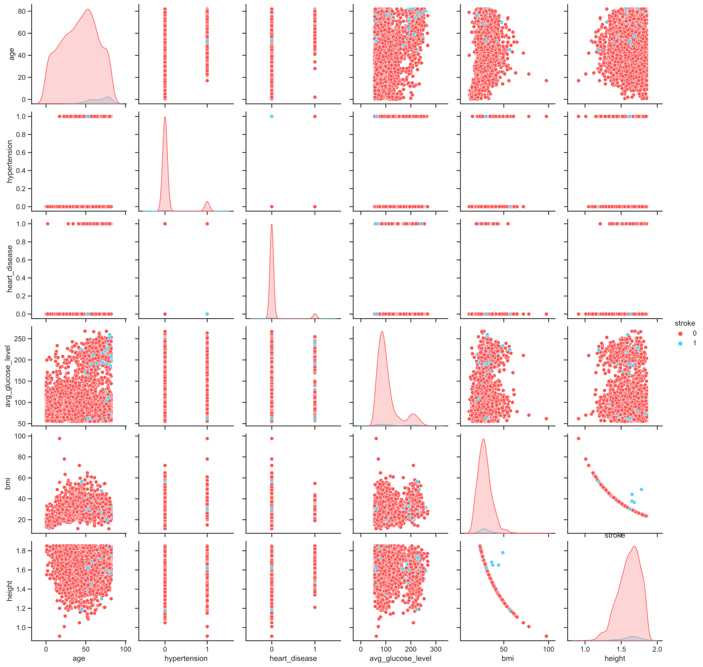
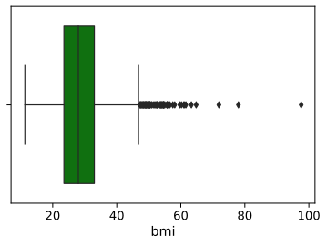
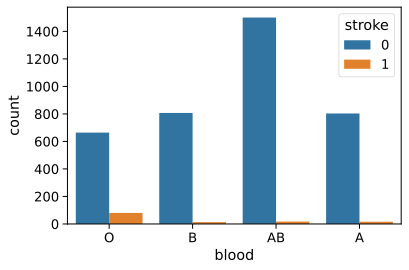

# Stroke Prediction

1. EDA
   - [x] Show info of dataset
```
 #   Column             Non-Null Count  Dtype  
---  ------             --------------  -----  
 0   gender             4000 non-null   object 
 1   age                3893 non-null   float64
 2   hypertension       3770 non-null   float64
 3   heart_disease      3910 non-null   float64
 4   ever_married       4000 non-null   object 
 5   work_type          4000 non-null   object 
 6   Residence_type     4000 non-null   object 
 7   avg_glucose_level  3829 non-null   float64
 8   bmi                2884 non-null   float64
 9   smoking_status     4000 non-null   object 
 10  blood              3990 non-null   object 
 11  height             2928 non-null   float64
 12  stroke             4000 non-null   int64  
 ```
   - [x] Draw missing data table

|                   | Total | Percent |
|-------------------|-------|---------|
|            height |  1072 | 0.26800 |
|      hypertension |   230 | 0.05750 |
| avg_glucose_level |   171 | 0.04275 |
|     heart_disease |    90 | 0.02250 |
|             blood |    10 | 0.00250 |
|            gender |     0 | 0.00000 |
|               age |     0 | 0.00000 |
|      ever_married |     0 | 0.00000 |
|         work_type |     0 | 0.00000 |
|    Residence_type |     0 | 0.00000 |
|               bmi |     0 | 0.00000 |
|    smoking_status |     0 | 0.00000 |
|            stroke |     0 | 0.00000 |
|           age_bin |     0 | 0.00000 |

   - [x] Pairplot

   - [x] Show correlation
```
stroke               1.000000
age                  0.196161
heart_disease        0.116838
avg_glucose_level    0.109547
hypertension         0.084755
bmi                  0.030560
height               0.029482
Name: stroke, dtype: float64
```
   - [x] Boxplot `BMI`



Ta thấy dữ liệu có nhiều người BMI lạ kì nên đã quyết định loại bỏ những dữ liệu có `BMI` lớn hơn 45
   - [x] Count unique value
```
Value counts: 

Female    2218 
Male      1625
Other      157
Name: gender, dtype: int64

0.0    3402
1.0     368
Name: hypertension, dtype: int64


0.0    3694
1.0     216
Name: heart_disease, dtype: int64

Yes    2626
No     1374
Name: ever_married, dtype: int64

Private          2305
Self-employed     631
children          539
Govt_job          508
Never_worked       17
Name: work_type, dtype: int64

Unknown    1987
Urban      1018
Rural       995
Name: Residence_type, dtype: int64

never smoked       1467
Unknown            1226
formerly smoked     686
smokes              621
Name: smoking_status, dtype: int64

AB    1544
A      841
B      829
O      776
Name: blood, dtype: int64

0    3870
1     130
Name: stroke, dtype: int64
```
   - [x] Show value percent
```
Female    55.450
Male      40.625
Other      3.925
Name: gender, dtype: float64


0.0    90.238727
1.0     9.761273
Name: hypertension, dtype: float64


0.0    94.475703
1.0     5.524297
Name: heart_disease, dtype: float64


Yes    65.65
No     34.35
Name: ever_married, dtype: float64


Private          57.625
Self-employed    15.775
children         13.475
Govt_job         12.700
Never_worked      0.425
Name: work_type, dtype: float64


Unknown    49.675
Urban      25.450
Rural      24.875
Name: Residence_type, dtype: float64


never smoked       36.675
Unknown            30.650
formerly smoked    17.150
smokes             15.525
Name: smoking_status, dtype: float64


AB    38.696742
A     21.077694
B     20.776942
O     19.448622
Name: blood, dtype: float64


0    96.75
1     3.25
Name: stroke, dtype: float64

```

Ta thấy `smoking_status` và `Residence_type` có dữ liệu `Unknown` khá cao (Đang tìm cách xử lí)
1. Preprocessing data
   - [x] Drop data with 'bmi' > 45
   - [x] Obtain the mean value of bmi for the age class
   - [x] Fill NaN with `0` for `hypertension` and `heart_disease`
   - [x] Fill NaN with `AB` for `blood` which is the highest distribution



   - [x] Use `One hot encoder` for `['gender', 'blood', 'smoking_status', 'Residence_type', 'work_type']`
   - [x] Use `label ecoder` for `ever_married` which `{'No': 0, 'Yes': 1}`
   - [x] Use `StandardScaler` for `['avg_glucose_level','bmi','age']`